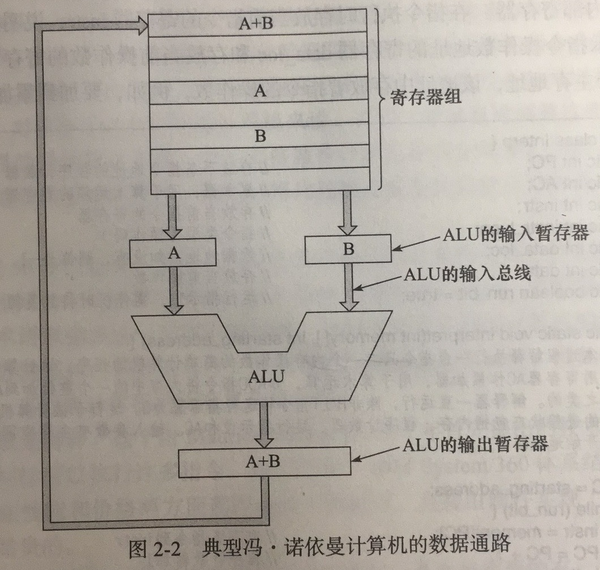

# 处理器(Central Processing Unit)
1. CPU由以部件组成：

    - 控制器：从主存储器中取指令和分析指令
    - 算术逻辑单元：通过完成如加法、逻辑等算数逻辑运算来执行指令
    - 寄存器组（一个小容量、高速度的存储器）：存放中间结果和一些控制信息
        * 程序计数器（Program Counter,PC）：指向下一条将被取出用于执行的指令
        * 指令寄存器（Instruction Register,IR）：存放当前正执行的指令
        * 通用寄存器
        * 专用寄存器等
2. 典型冯・诺依曼计算机的数据通路：

- 数据通路组成:
    * 寄存器(1-32个)
    * 算数逻辑部件
    * 内部总线

- 大多数指令可以归并到下面两类当中：
    * 寄存器-主存指令：用于寄存器和主存储器之间交换数据
    * 寄存器-寄存器指令：用于寄存器和寄存器之间交换数据

- 数据通路周期：ALU将两个操作数进行运算并将结果写回的过程

# 主存储器
# 辅助存储器
# 输入／输出设备
