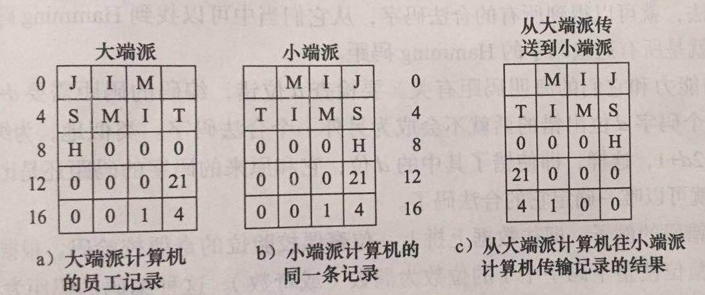

# 处理器(Central Processing Unit)
1. CPU由以部件组成：

    - 控制器：从主存储器中取指令和分析指令
    - 算术逻辑单元：通过完成如加法、逻辑等算数逻辑运算来执行指令
    - 寄存器组（一个小容量、高速度的存储器）：存放中间结果和一些控制信息

        * 程序计数器（Program Counter,PC）：指向下一条将被取出用于执行的指令
        * 指令寄存器（Instruction Register,IR）：存放当前正执行的指令
        * 通用寄存器
        * 专用寄存器等
2. 典型冯・诺依曼计算机的数据通路：

- 数据通路组成:
    * 寄存器(1-32个)
    * 算数逻辑部件
    * 内部总线

- 大多数指令可以归并到下面两类当中：

    * 寄存器-主存指令：用于寄存器和主存储器之间交换数据
    * 寄存器-寄存器指令：用于寄存器和寄存器之间交换数据

- 数据通路周期：ALU将两个操作数进行运算并将结果写回的过程

3.**指令执行：**

* 指令的基本执行过程：

    1. 从主存中取下一条指令到指令寄存器中
    2. 将程序计数器指向后面的一条指令
    3. 判断取得的指令的类型
    4. 若该指令用到某主存单元，则对该主存单元进行寻址
    5. 必要时，从主存中取一个字到cpu的寄存器中
    6. 执行指令
    7. 返回第一步准备执行下一条指令

> 这个过程通常称为 **取值-译码-执行** 周期，是所有计算机操作的核心。

* 解释器：用来获取、分析、执行其他程序指令的程序。（微程序也是解释器）

* RISC & CISC :
    * RISC（精简指令计算机）: 选择少量能在上述数据通路的一个周期内执行的简单指令来设计计算机。
    * CISC（复杂指令计算机）：指令集相对庞大，单个指令相对复杂的计算机。

4. 现代计算机设计原则：

    * 所有常用指令应该交给硬件直接执行

    * 最大限度提高指令的启动速度

    * 指令应该容易译码

    * 只允许读写主存指令访问主存

    * 提供足够寄存器

5. 指令级并行：使计算机在单位时间内处理更多的指令

    * 指令流水

    * 超标量体系结构

6. 处理器级并行：多个CPU一起工作，解决同一个问题

    * 数据并行计算机

    * 多处理器

    * 多计算机

# 主存储器

1. 存储位：二进制

2. 内存编址

    * 地址：存储器由许多可存放一段信息的单元（或位置）组成，每个单元有一个编号，程序可以通过这个编号来访问这个单元，这个编号就是这个单元的地址。

    * 最小可编址单位：字节（八位组），字节再组合成**字**，32位字计算机每个字有4字节，64位字计算机每个字有8字节，由此得出32位计算机的寄存器为32位，64位计算机的寄存器为64位。

3. 字节顺序

    * 大端派：每个字中的字节地址从左到右编排

    * 小端派：每个字中的字节地址从右到左编排

    * 在计算机之间交换数据时，如果两个机器字节顺序不同，会造成：

        -        
        
        - 应该清楚，在计算机之间交换数据时，如果没有一个统一的标准，是一件麻烦事

4. 纠错码

5. 高速缓存（cache)

6. 内存封装及其类型

    * 内存封装：将一组内存芯片，一般是8或16片一起安装在一块印刷电路板上。

    * 根据电路板上的连线是一面还是两面，一般把内存分为：

        * 单面接头内存条（SIMM）：现在已经不常见到了

        * 双面接头内存条（DIMM）：常见的有DDR3（双倍数据速率第三版）的DIMM

# 辅助存储器

1. 层次存储结构：见书P59，不多赘述

2. 磁盘

    * 磁盘组成：P60-P61

    * 磁盘控制器；接受软件发出的如READ、WRITE和FORMAT等命令。有些控制器中甚至有一个完整的CPU。

3. IDE（集成驱动器电路）盘：将控制器与磁盘驱动器集成在一起。

4. SCSI盘

5. RAID盘

6. 固盘

7. 只读光盘

8. 可刻光盘

9. 可擦写光盘

10. DVD

11. Blu-Ray

# 输入／输出设备

1. 总线

2. 终端

3. 鼠标

4. 游戏控制器

5. 打印机

6. 电信设备

7. 数码相机

8. 字符编码

